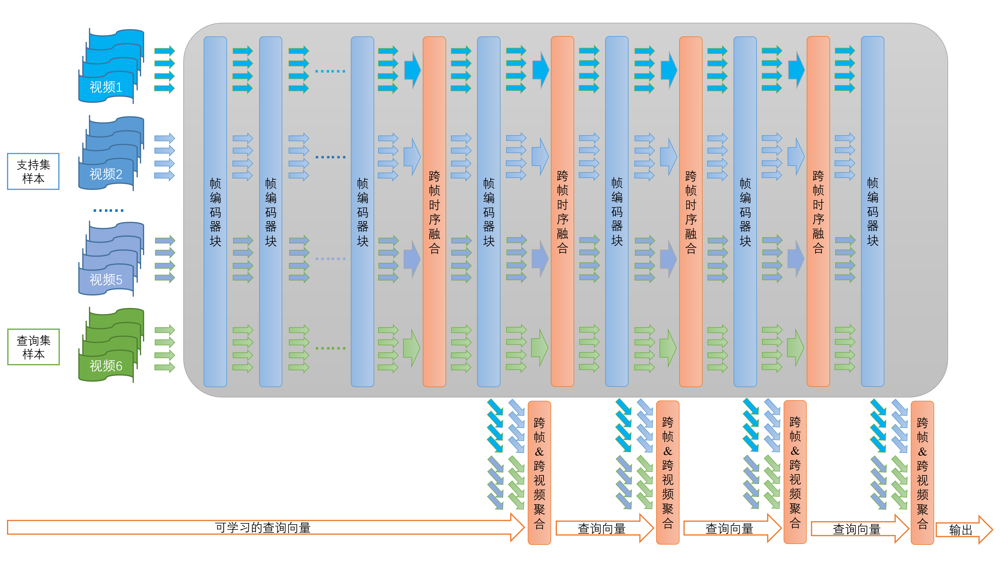

# 视频旁路聚合器（Video Bypass Aggregator, VBA）

学士学位论文
[下载](./Understanding_Few-shot_Video_with_Pretrained_Image-Text_Models.pdf)

### 标题：基于图文对预训练权重的小样本视频理解

### 指导老师: [鲁继文](https://scholar.google.com/citations?user=TN8uDQoAAAAJ&hl=en-US), [周杰](https://scholar.google.com/citations?user=6a79aPwAAAAJ&hl=en), [唐彦嵩](https://andytang15.github.io/)



### 摘要：
现存大多数的小样本视频分类方法在设计时并未考虑到预训练知识的迁移，在直接引入图文对预训练知识后精度非最优，且迁移效率偏低。
而现存的采用监督学习的全样本视频分类方法，对每个样本独立编码，因此在小样本任务中无法联合编码支持集、查询集的全部样本。

为了将图文对预训练模型的场景建模能力有效迁移到视频领域，并在小样本视频分类任务上取得良好效果，本文提出了视频旁路聚合器（Video Bypass Aggregator, VBA）结构。
通过跨层信息聚合，方法有效地迁移了预训练特征的多粒度场景建模能力。
通过跨帧信息聚合，方法充分学习到针对视频的时序建模能力。
通过跨视频信息聚合，方法联合利用支持集、查询集的所有样本信息，对每个样本获得更加鲁棒的特征表示。

在6个主流视频数据集共7种小样本划分下，本文方法相比同设定下的已有方法达到更高或可比精度，证明了方法的整体有效性。
消融实验证明了本文各模块的作用。本文还论证了方法的训练高效性，展示了跨域理解能力，并给出了注意力图的定性可视化。

### 结果：

| 数据集   | 骨干网络        | 配置文件          | 本文Top-1 精度 <br>(之前的 SOTA)  | 本文Top-5 精度 <br>(之前的 SOTA)  | 下载模型权重 |
|---------------|-----------|-------------------------------------------------------------------------------|---------------|------------|-----|
| Kinetics      | CLIP ViT-B/32  |  [config](/configs/fewshot/matchingnet/vit32_main/k_vit32_clip_freeze_5.py)   |  86.2 (82.0)  |   95.1 (91.4) | wget --no-check-certificate https://cloud.tsinghua.edu.cn/f/17c1e58c34144481967a/?dl=1 |
| minissv2_small| CLIP ViT-B/32  |  [config](/configs/fewshot/matchingnet/vit32_main/s_vit32_clip_temporal_5.py) |  52.1 (48.3)  |   71.2 (64.1) | wget --no-check-certificate https://cloud.tsinghua.edu.cn/f/2a560b10b1b54976afa6/?dl=1 |           
| minissv2_full | CLIP ViT-B/32  |  [config](/configs/fewshot/matchingnet/vit32_main/f_vit32_clip_temporal_5.py) |  61.5 (59.0)  |   74.7 (74.9) | wget --no-check-certificate https://cloud.tsinghua.edu.cn/f/25948c7b28a34ceab949/?dl=1 |          
| HMDB51        | CLIP ViT-B/32  |  [config](/configs/fewshot/matchingnet/vit32_main/h_vit32_clip_temporal_5.py) |  73.4 (71.1)  |   87.1 (83.9) | wget --no-check-certificate https://cloud.tsinghua.edu.cn/f/e76620555fb242b794a9/?dl=1 |          
| UCF101        | CLIP ViT-B/32  |  [config](/configs/fewshot/matchingnet/vit32_main/u_vit32_clip_freeze_5.py)   |  91.9 (92.6)  |   97.5 (96.8) | wget --no-check-certificate https://cloud.tsinghua.edu.cn/f/ae95b2f886934b288292/?dl=1 |           
| Diving48      | CLIP ViT-B/32  |  [config](/configs/fewshot/matchingnet/vit32_main/d_vit32_clip_temporal.py)   |  75.7 (74.4)  |   90.1 (85.6) | wget --no-check-certificate https://cloud.tsinghua.edu.cn/f/f6787f69207d4ace9c87/?dl=1 |           
| Gym99         | CLIP ViT-B/32  |  [config](/configs/fewshot/matchingnet/vit32_main/g_vit32_clip_temporal.py)   |  91.3 (90.0)  |   95.4 (93.6) | wget --no-check-certificate https://cloud.tsinghua.edu.cn/f/5bf3a6e177d840b4abdb/?dl=1 |           

* Previous SOTA 指代 [HyRSM](https://arxiv.org/abs/2204.13423) (CVPR 2022), 其骨干网络被替换为 CLIP ViT-B/32.


### 准备环境

```bash
# 准备 conda 环境
conda create -n vba python=3.8
pip install torch==1.10.0+cu113 torchvision==0.11.0+cu113 torchaudio==0.10.0 -f https://download.pytorch.org/whl/torch_stable.html
pip install mmcv-full==1.5.0 -f https://download.openmmlab.com/mmcv/dist/cu113/torch1.10.0/index.html
pip install decord scipy einops tensorboard imgaug setuptools==59.5.0 yapf==0.40.1 numpy==1.23.0
pip install -e .

# 准备预训练权重
wget https://openaipublic.azureedge.net/clip/models/40d365715913c9da98579312b702a82c18be219cc2a73407c4526f58eba950af/ViT-B-32.pt
mv ViT-B-32.pt root_dir/data/clip_weight/
```


### 准备数据

本仓库仅提供 Mini-Kinetics、Mini-SSV2、HMDB51、UCF101、Diving48 的小样本数据集。Gym99 的数据集请参考其官方仓库。

```bash
# Mini-Kinetics, about 6G
cd root_dir/data/minikinetics
wget --no-check-certificate https://cloud.tsinghua.edu.cn/f/8b68f113b19a48338072/?dl=1
mv index.html\?dl\=1 minikinetics_videos.zip
unzip -q minikinetics_videos.zip

# Mini-SSV2, about 8G
cd root_dir/data/minissv2
wget --no-check-certificate https://cloud.tsinghua.edu.cn/f/bde18b48b9054143a1f4/?dl=1
mv index.html\?dl\=1 minissv2_videos.zip
unzip -q minissv2_videos.zip

# HMDB51, about 2G
cd root_dir/data/hmdb51
wget --no-check-certificate https://cloud.tsinghua.edu.cn/f/dd6fe5c35eb44b3fa2ca/?dl=1
mv index.html\?dl\=1 hmdb51_videos.zip
unzip -q hmdb51_videos.zip

# UCF101, about 7G
cd root_dir/data/ucf101
wget --no-check-certificate https://cloud.tsinghua.edu.cn/f/075698d33fcb4c6e84e9/?dl=1
mv index.html\?dl\=1 ucf101_videos.zip
unzip -q ucf101_videos.zip

# Diving48, about 5G
cd root_dir/data/diving48
wget --no-check-certificate https://cloud.tsinghua.edu.cn/f/d6e13e50c9b64bfca9b0/?dl=1
mv index.html\?dl\=1 diving48_videos.zip
unzip -q diving48_videos.zip
```

### 训练和测试
```bash
python tools/train.py <config_path> --validate  # train
python tools/test.py <config_path> <ckpt_path>  # test
```
为了获得论文中的精确结果，请使用提供的数据和权重，并参考 `tools/train_and_test0.sh` and `tools/train_and_test1.sh`.
